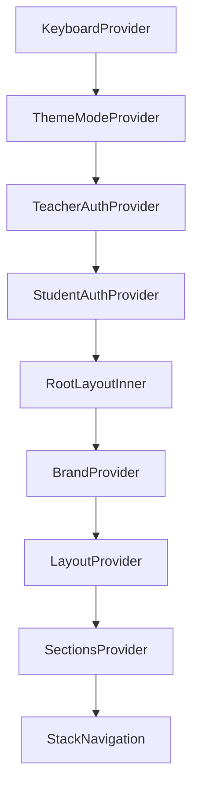

# 01 — Architecture Overview & Codebase Structure

## 1. Executive Summary

**Our School App** (Institute App) is an enterprise-grade cross-platform educational portal engineered using **React Native**, **Expo SDK 52**, **Expo Router v4**, and **TypeScript**. It seamlessly serves three distinct audiences:
1. **Public Visitors / Prospective Parents**: News, events, gallery albums, principal message, top achievers, staff directory, and mandatory disclosures.
2. **Students & Parents**: Homework calendar, daily attendance records, leave application submission, result/report cards, fee invoice viewing, and notification center.
3. **Teachers & Administration**: Class roster management, bulk attendance marking, homework creation with attachments, event/notice publishing, leave application review, fee invoice creation, and Excel data import/export.

---

## 2. Directory Structure & Module Responsibilities

```text
school_app_react_native/
├── assets/                  # Icons, splash images, fonts, sounds
├── dist/                    # Static Web Production Export bundle
├── docs/                    # Complete Architecture & System Documentation
│   ├── 01_ARCHITECTURE_OVERVIEW.md
│   ├── 02_COMPLETE_SCREEN_DIRECTORY.md
│   ├── 03_API_INTEGRATION_AND_ENDPOINTS.md
│   ├── 04_AUTHENTICATION_AND_SECURITY.md
│   ├── 05_DESIGN_SYSTEM_AND_THEMING.md
│   ├── 06_PERFORMANCE_LAZY_LOADING_AND_SCALING.md
│   └── 07_FROM_SCRATCH_ENTERPRISE_BLUEPRINT.md
├── src/                     # Core Application Source Code
│   ├── app/                 # Expo Router file-based routes & screens (53+ routes)
│   │   ├── (tabs)/          # Root tab navigation (_layout, index, events, gallery, more)
│   │   ├── apply-leave.tsx  # Student leave application screen
│   │   ├── homework.tsx     # Student homework calendar & list
│   │   ├── login.tsx        # Role selection screen
│   │   ├── profile.tsx      # User profile screen
│   │   ├── student-dashboard.tsx # Student dashboard
│   │   ├── teacher-dashboard.tsx # Teacher dashboard
│   │   ├── teacher-login.tsx     # Teacher login screen
│   │   └── ... (all operational screens)
│   ├── components/          # Reusable UI Components & Modals
│   │   ├── onboarding/      # Onboarding flows & Institute setup
│   │   └── ui/              # Buttons, Cards, Headers, Drawers, PDF Exporter
│   ├── constants/           # Design tokens, Spacing, Radius, Shadow, Typography
│   ├── data/                # Data Access Layer & API Clients (api.ts, teacher-api.ts, homework-api.ts)
│   ├── hooks/               # Application State & Custom React Hooks
│   │   ├── use-student-auth.tsx # Student authentication & child switching
│   │   ├── use-teacher-auth.tsx # Teacher authentication & session token
│   │   ├── use-theme.ts         # Theme context (Dark / Light mode)
│   │   ├── use-brand.ts         # Dynamic database branding context
│   │   ├── use-layout.ts        # App status & layout configuration
│   │   └── use-sections.ts      # Admin section permissions toggle
│   └── lib/                 # Utilities, Storage, Notifications, PDF Exporter, Device Info
├── app.json                 # Expo Application Configuration
├── API_DOCUMENTATION.md     # Single-file API Reference
├── KNOWLEDGE_BASE.md        # Single-file Technical Knowledge Base
└── server.js                # Local Web Preview HTTP Server (Port 8081)
```

---

## 3. Provider Tree & Application State Flow

The root layout (`src/app/_layout.tsx`) initializes the provider hierarchy wrapping the entire application:



### Key Provider Responsibilities:
1. **`ThemeModeProvider`**: Manages manual theme override (`light`, `dark`, or `system`).
2. **`TeacherAuthProvider`**: Reads local teacher token, executes `fetchTeacherProfile()`, and provides `loggedIn`, `profile`, and `setLoggedIn`.
3. **`StudentAuthProvider`**: Reads stored student/child profiles via `getHomeworkAccess()`, provides `loggedIn`, `access`, `allChildren`, `switchChild`, and `refresh`.
4. **`BrandProvider`**: Supplies dynamic institute branding (Logo URL, Primary Color, Accent Color, App Title) fetched from `/app_status`.
5. **`LayoutProvider`**: Manages home screen tiles layout, bottom tab bar items, and `instituteMode` flag.
6. **`SectionsProvider`**: Toggles section availability (`homework`, `attendance`, `notices`, `events`, `gallery`, `result`, `fees`) based on admin settings.

---

## 4. Operational Resiliency & Fail-Open Strategy

- **Network Hiccup Protection**: On app boot, `fetchAppStatus()` is fetched. If network fails or backend responds with an error, the app uses `FAIL_OPEN_STATUS`, allowing users to access cached features without locking them out.
- **Connectivity Probing**: `expo-network` state changes trigger an active `HEAD` probe to `${BASE_URL}/app_status` before rendering an offline screen, preventing false-positive offline takeovers.
